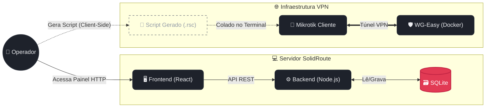

# SolidRoute Portal

O **SolidRoute** é um sistema web Open Source de página única (SPA) criado para automatizar a gestão e a adoção de roteadores **Mikrotik** distribuídos em clientes via túneis **WireGuard**.

O portal reúne três funções: cadastro/registro dos roteadores já adotados, um gerador de script de adoção automatizado (para colar no Mikrotik) e gestão de usuários com acesso ao painel.

---

## 🏗️ Arquitetura

A infraestrutura ideal do projeto é desacoplada. O gerador de scripts (SolidRoute) não precisa rodar na mesma máquina que o servidor VPN, garantindo total flexibilidade.



> 💡 **Deploy atual vs. ideal:** hoje Portal e WG-Easy podem estar rodando lado a lado no mesmo host — o diagrama acima mostra a separação lógica de responsabilidades, não necessariamente máquinas físicas diferentes. Nada no código acopla os dois: o Portal nunca chama a API do WG-Easy, e o script gerado só depende de você colar as chaves manualmente.

---

## ✨ Funcionalidades

| Tela | O que faz |
|---|---|
| 🔐 **Login** | Autenticação por e-mail/senha → recebe JWT, salvo em `localStorage` |
| 📡 **Roteadores (Dashboard)** | Lista MikroTiks cadastrados (nome, IP na VPN, porta), com busca, cadastro, exclusão e atalho para acessar o painel de cada um. Atualização automática via polling |
| 📄 **Gerador de Script** | Formulário com IP do cliente na VPN, chaves WireGuard e dados do DDNS → gera o script RouterOS completo, pronto para copiar e colar |
| 👥 **Gestão de Equipe** | Cadastro, listagem e exclusão de usuários com acesso ao painel |

---

## 🔧 O Que o Script de Adoção Configura

O gerador roda **100% no navegador** — nenhuma chamada ao backend é feita nesse fluxo, o script é montado localmente a partir do que você preenche no formulário. Ele monta, via `/system script` no RouterOS:

- **Interface WireGuard** dedicada, com a private key do cliente.
- **Endereço IP** do cliente na subnet da VPN.
- **Peer WireGuard** — public key do servidor, preshared key, endpoint (host + porta do DDNS), `persistent-keepalive`.
- **Rota** para a subnet da VPN, usando a interface WireGuard como gateway.
- **Firewall** — regras restritas à interface WireGuard, liberando apenas o necessário (Winbox e o painel web do próprio Mikrotik), inseridas com prioridade máxima na cadeia.
- **Scheduler de watch do DDNS** — reaplica o `endpoint-address` do peer periodicamente, para acompanhar mudanças de IP do DDNS.

O script é idempotente: se já existir no Mikrotik, ele é **atualizado** em vez de duplicado, e roda automaticamente ao final.

---

## 🧰 Stack Tecnológica

| Camada | Tecnologia |
|---|---|
| Backend | Node.js / Express — API REST, autenticação JWT |
| Frontend | React 18 (UMD) + Babel standalone, via CDN — SPA single-file, sem build step |
| Estilo | Tailwind CSS (CDN), Font Awesome, Google Fonts |
| Banco de dados | SQLite (via `better-sqlite3`) |
| VPN | WireGuard, gerenciado via **WG-Easy** |
| Roteadores clientes | Mikrotik (RouterOS) |
| Deploy | Docker |

---

## 🔒 Segurança

- Acesso ao painel via HTTP puro exige atenção — recomenda-se HTTPS em produção.
- O JWT fica salvo em `localStorage`: avaliar migrar para cookie `httpOnly` se o projeto for exposto além da rede interna.
- As chaves WireGuard (private key, preshared key) passam em texto plano pelo formulário do Gerador de Script — evite printar ou compartilhar essa tela.
- As regras de firewall geradas liberam Winbox e o painel web **apenas via túnel WireGuard**, nunca diretamente pela internet.
- Nenhum dado sensível de infraestrutura real (IPs internos, domínio DDNS, segredos) deve ir para o repositório — use variáveis de ambiente (`.env`, fora do controle de versão).

---

## ⚙️ Configuração de Ambiente

> Preencher com os valores reais do seu deploy antes de publicar.

```env
PORT=3000
JWT_SECRET=<gere um valor aleatorio e mantenha em segredo, fora do repositorio>
DB_PATH=<caminho do arquivo .db no servidor>
```

> ⚠️ **DDNS não entra aqui de propósito.** O host/porta do DDNS usado no túnel WireGuard é dado privado da infraestrutura e não deve ser versionado — mantenha essa configuração fora do repositório (variável de ambiente local, secret manager, ou preenchida manualmente no Gerador de Script quando for usar).

- **Persistência do banco:** o arquivo do `better-sqlite3` deve estar em um **volume montado** — sem isso, os dados (roteadores, usuários) somem a cada recriação do container.
- **WG-Easy:** configure as variáveis de ambiente próprias do WG-Easy (senha de admin, porta, host) conforme a [documentação oficial do projeto](https://github.com/wg-easy/wg-easy).

---

## 🗺️ Roadmap

- [ ] Migrar acesso ao portal para HTTPS.
- [ ] Mover segredos (JWT, DDNS, IPs) para variáveis de ambiente.
- [ ] Registrar processo de rotação de chaves WireGuard por roteador.
- [ ] Changelog de versões do script de adoção.

---

## 📄 Licença

Este projeto ainda não tem uma licença definida. Até que isso mude, todos os direitos são reservados por padrão.
