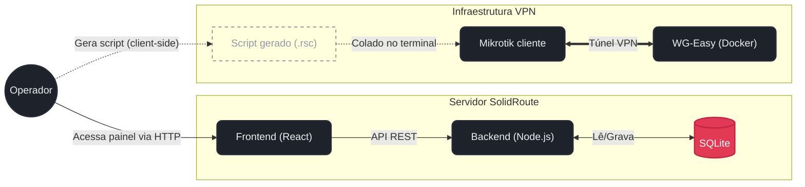

# SolidRoute Portal

Portal para gerenciar a adoção de roteadores Mikrotik via WireGuard. Em vez de configurar cada túnel WireGuard na mão, você preenche um formulário com as chaves e o endereço do DDNS, o portal monta o script RouterOS pronto, e você só cola no terminal do Mikrotik.

Também serve como registro dos roteadores já adotados (nome, IP na VPN, porta de acesso) e tem uma tela simples de gestão de usuários do painel.

## Arquitetura

O gerador de script não depende do servidor WireGuard estar na mesma máquina — ele só monta o texto do script no navegador, com o que você digitou no formulário.



O backend nunca fala com o WG-Easy nem com o Mikrotik — a única ponte entre eles é você colando o script gerado.

## Rodando

```bash
npm install
node server.js
```

Sobe na porta `3000` por padrão. Na primeira execução, se o banco estiver vazio, é criado um usuário admin com login `admin@smartstik.com` e senha `admin123` — **troque essa senha assim que logar pela primeira vez**, isso não é feito automaticamente.

O banco fica em `data/smartstik.db`, criado na primeira execução se a pasta não existir. Se for rodar em Docker, monte um volume nesse caminho, senão os dados somem toda vez que o container reiniciar.

### Variáveis de ambiente

```env
PORT=3000
JWT_SECRET=
```

`PORT` tem fallback pra `3000` se não for definida. `JWT_SECRET` também tem um valor padrão hardcoded no código caso a variável não exista — não conte com ele, defina o seu próprio antes de colocar em produção.

O host e a porta do DDNS usados no túnel WireGuard não ficam em variável de ambiente nenhuma — são preenchidos direto no formulário do Gerador de Script, na hora de gerar cada script. Propositalmente não versionamos isso em lugar nenhum do repositório.

## O que o script gerado faz

No Mikrotik, o script cria a interface WireGuard, adiciona o peer com as chaves e o endpoint informados, adiciona a rota pra subnet da VPN, libera Winbox e o painel web só através do túnel (nada exposto direto na internet), e cria um scheduler que reaplica o endereço do peer a cada hora — isso cobre o caso do IP por trás do DDNS mudar.

Rodar o script de novo não duplica nada: ele atualiza a configuração existente em vez de criar tudo de novo.

## Stack

Node.js/Express no backend, React (via CDN, sem build) no frontend, SQLite (`better-sqlite3`) como banco, WireGuard gerenciado pelo WG-Easy.

## Segurança

O acesso ao painel hoje é HTTP puro — se for expor além da rede local, vale colocar atrás de um proxy com TLS. O JWT fica em `localStorage`, o que é aceitável pra uso interno mas não seria minha escolha se o painel for ficar acessível de fora. As chaves WireGuard trafegam em texto plano pelo formulário do Gerador de Script — é só pra copiar e colar, não fica salvo em lugar nenhum, mas evite deixar a tela visível/gravada.

## Licença

Ainda sem licença definida.
