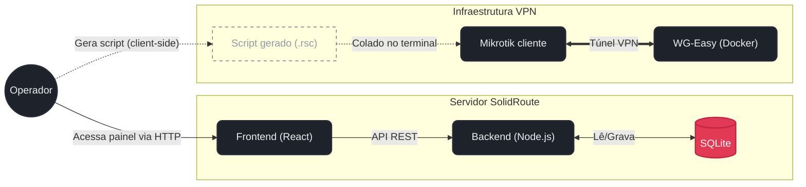

# SolidRoute Portal

Portal para gerenciar a adoção de roteadores Mikrotik via WireGuard. Em vez de configurar cada túnel WireGuard na mão, você preenche um formulário com as chaves e o endereço do DDNS, o portal monta o script RouterOS pronto, e você só cola no terminal do Mikrotik.

Também serve como registro dos roteadores já adotados (nome, IP na VPN, porta de acesso) e tem uma tela simples de gestão de usuários do painel.

## Arquitetura

O gerador de script não depende do servidor WireGuard estar na mesma máquina — ele só monta o texto do script no navegador, com o que você digitou no formulário.



O backend nunca fala com o WG-Easy nem com o Mikrotik — a única ponte entre eles é você colando o script gerado.

## WireGuard (WG-Easy)

O túnel VPN entre os Mikrotiks e o servidor é gerenciado pelo [WG-Easy](https://github.com/wg-easy/wg-easy), rodando em Docker. É o WG-Easy quem gera o par de chaves do servidor e cada peer, e disponibiliza a interface web onde você acompanha quem tá conectado.

```bash
docker run -d \
  --name wg-easy \
  -e WG_HOST=<seu-ddns-ou-ip-publico> \
  -v ~/.wg-easy:/etc/wireguard \
  -p 51820:51820/udp \
  -p 51821:51821/tcp \
  --cap-add=NET_ADMIN \
  --cap-add=SYS_MODULE \
  --sysctl="net.ipv4.conf.all.src_valid_mark=1" \
  --sysctl="net.ipv4.ip_forward=1" \
  ghcr.io/wg-easy/wg-easy
```

O Portal e o WG-Easy são duas aplicações independentes — o Portal não chama a API do WG-Easy nem sabe que ele existe. A ponte entre os dois é manual: você cria o peer no WG-Easy, pega a chave pública do servidor e a preshared key geradas lá, e cola esses valores no Gerador de Script do Portal.

## Rodando o Portal

```bash
npm install
node server.js
```

Sobe na porta `3000` por padrão. Na primeira execução, se o banco estiver vazio, é criado um usuário admin com login `admin@smartstik.com` e senha `admin123` — **troque essa senha assim que logar pela primeira vez**, isso não é feito automaticamente.

O banco fica em `data/smartstik.db`, criado na primeira execução se a pasta não existir. Se for rodar em Docker, monte um volume nesse caminho, senão os dados somem toda vez que o container reiniciar.

### Variáveis de ambiente

```env
PORT=3000
JWT_SECRET=
```

`PORT` tem fallback pra `3000` se não for definida. `JWT_SECRET` também tem um valor padrão hardcoded no código caso a variável não exista — não conte com ele, defina o seu próprio antes de colocar em produção.

O host e a porta do DDNS usados no túnel WireGuard não ficam em variável de ambiente nenhuma — são preenchidos direto no formulário do Gerador de Script, na hora de gerar cada script. Propositalmente não versionamos isso em lugar nenhum do repositório.

## O que o script gerado faz

A tela "Gerador de Script" pede: IP do cliente na VPN, private key do cliente, preshared key, public key do servidor, host e porta do DDNS. Com isso, monta um `/system script` chamado `setup-smartstik` que faz, na ordem:

1. **Interface WireGuard** `wg-smartstik`, MTU 1420, com a private key do cliente. Se a interface já existir, só atualiza a chave em vez de recriar.
2. **Endereço IP** na interface — por padrão `10.90.0.2/24`, mas o campo é editável pra cada roteador.
3. **Peer** apontando pro servidor: public key, preshared key, `endpoint-address` = host do DDNS, `endpoint-port`, `allowed-address` = subnet fixa `10.90.0.0/24`, `persistent-keepalive=25s`. O peer é identificado pelo comment `SmartsTIK-server`, usado depois pelo scheduler.
4. **Rota** pra subnet da VPN, com a interface WireGuard como gateway.
5. **Firewall** — duas regras, restritas a `in-interface=wg-smartstik`: uma libera TCP/8291 (Winbox), outra libera TCP/8123 (o painel web do próprio Mikrotik). As duas são inseridas antes da primeira regra já existente no firewall (`place-before`), pra garantir que não fiquem atrás de algum `drop` genérico.
6. **Scheduler** `SmartsTIK-DDNS`, rodando a cada 1 hora, que reaplica o `endpoint-address` do peer (busca pelo comment `SmartsTIK-server`). Isso existe porque o RouterOS resolve o hostname do DDNS só quando o peer é configurado — sem isso, se o IP por trás do DDNS mudar, o túnel fica apontando pro IP antigo até alguém mexer manualmente.

No final, o script roda sozinho (`/system script run setup-smartstik`) e loga no sistema do Mikrotik que terminou.

Colar o script de novo não duplica nada — ele checa se cada parte já existe (`:if ([:len [...]] = 0)`) e só atualiza o que já tá lá.

## Stack

Node.js/Express no backend, React (via CDN, sem build) no frontend, SQLite (`better-sqlite3`) como banco, WireGuard gerenciado pelo WG-Easy.

## Segurança

O acesso ao painel hoje é HTTP puro — se for expor além da rede local, vale colocar atrás de um proxy com TLS. O JWT fica em `localStorage`, o que é aceitável pra uso interno mas não seria minha escolha se o painel for ficar acessível de fora. As chaves WireGuard trafegam em texto plano pelo formulário do Gerador de Script — é só pra copiar e colar, não fica salvo em lugar nenhum, mas evite deixar a tela visível/gravada.

## Licença

Ainda sem licença definida.
